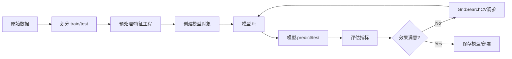

## Scikit-learn 超详细教程：从宏观框架到核心流程

> 如果你刚开始接触 `sklearn`，可能会被它的模块名、类名、方法名搞得眼花缭乱。  
> 但别慌，**它的设计非常规整，就像一套乐高——只要理解了基础块怎么拼，剩下的就是自由组合**。  
> 这篇教程的目标就是帮你建立 **框架感、逻辑感、顺序感**，让你在脑海里画出一张清晰的地图，之后不管是自己写代码还是看别人代码，都能快速定位“现在在哪一步”。

---

## 一、sklearn 的“世界观”：一个统一的接口

sklearn 最牛逼的地方在于：**它几乎把所有机器学习的东西，都抽象成了同一个对象——估计器（Estimator）**。  
不管你是做分类、回归、聚类、降维，还是做特征缩放、特征选择、模型融合，它们在你眼里都是“一个对象”，都遵循同样的使用方法。

**核心口诀**：  
- 所有东西都是 **估计器**（Estimator）  
- 估计器分为两类：
  - **转换器（Transformer）**：用来“加工数据”，比如标准化、PCA。它们有 `fit()`、`transform()`、`fit_transform()` 方法。
  - **预测器（Predictor）**：用来“做预测”，比如逻辑回归、随机森林。它们有 `fit()`、`predict()`、`score()` 方法。

**大白话**：  
> 在 sklearn 的世界里，任何能“学习”的东西，都是估计器。学习完了要么帮你转换数据（Transformer），要么帮你预测新数据（Predictor）。它们的学习过程都叫 `fit()`，干活的接口要么是 `transform()`，要么是 `predict()`。

---

## 二、宏观模块一览：sklearn 的“工具箱”

打开 sklearn 的官方文档，你会看到十几个模块，但真正最常用、最核心的就这几块。我把它们按“你在实际项目中碰到的顺序”排列：

| 模块（常用导入名） | 干什么的 | 大白话 |
|------------------|---------|--------|
| `sklearn.datasets` | 内置数据集 | 给你一些现成的数据，方便练手。比如鸢尾花、波士顿房价。 |
| `sklearn.model_selection` | 模型选择与评估 | 帮你把数据拆成训练集/测试集、做交叉验证、搜索超参数。 |
| `sklearn.preprocessing` | 数据预处理 | 把原始数据变成算法能吃的样子。比如标准化、归一化、编码类别特征。 |
| `sklearn.feature_extraction` | 特征提取 | 从非数值数据（文本、图像）里抽特征，比如文本转 TF-IDF。 |
| `sklearn.feature_selection` | 特征选择 | 从一堆特征里挑出最有用的一些，降维但不改变特征含义。 |
| `sklearn.decomposition` | 降维（无监督） | 把高维数据压到低维，比如 PCA（主成分分析）。 |
| `sklearn.linear_model` | 线性模型 | 线性回归、逻辑回归、岭回归、Lasso 等。 |
| `sklearn.svm` | 支持向量机 | SVC（分类）、SVR（回归）。 |
| `sklearn.tree` | 决策树 | 决策树分类/回归。 |
| `sklearn.ensemble` | 集成方法 | 随机森林、梯度提升、AdaBoost。 |
| `sklearn.cluster` | 聚类 | KMeans、DBSCAN 等。 |
| `sklearn.metrics` | 评估指标 | 准确率、精确率、召回率、RMSE 等。 |
| `sklearn.pipeline` | 管道 | 把一堆转换器和预测器串起来，一气呵成。 |

**你的任务**：先记住这张表，知道需要什么功能就去哪个模块里翻。以后用熟了，自然就知道更细的子模块了。

---

## 三、典型工作流：从数据到模型，一步步走

一个标准的使用 sklearn 的机器学习项目，通常按这个顺序走：

1. **加载数据** → 2. **划分训练/测试集** → 3. **预处理** → 4. **特征工程（可选）** → 5. **选择模型** → 6. **训练模型** → 7. **评估模型** → 8. **调参优化** → 9. **部署预测**

下面我把每一步拆开，用大白话解释“这一步在干什么”，以及对应的 sklearn 工具。

---

### 第 1 步：加载数据

- **目的**：把数据弄到内存里。  
- **sklearn 工具**：
  - `datasets.load_*()` 加载玩具数据集（比如 `load_iris()`）
  - `datasets.fetch_*()` 下载稍大的数据集（比如 `fetch_california_housing()`）
  - 当然，实际项目中更多的是用 pandas 读 CSV，再转成 sklearn 能接受的 `X`（特征矩阵，二维）和 `y`（目标向量，一维）。

**核心概念**：  
- `X`：形状 `(n_samples, n_features)`，每一行是一个样本，每一列是一个特征。  
- `y`：形状 `(n_samples,)`，每个样本对应的标签（监督学习）或没有（无监督学习）。

**大白话**：  
> 数据就是一张大表格，X 是除了最后一列以外的所有列，y 是最后一列（标签）。如果你做无监督学习，就没有 y。

---

### 第 2 步：划分训练集和测试集

- **目的**：拿出一部分数据假装没见过，用来验证模型是不是真的学好了（避免“作弊”）。  
- **sklearn 工具**：`model_selection.train_test_split`

**代码示例**（伪代码风格）：
```python
from sklearn.model_selection import train_test_split
X_train, X_test, y_train, y_test = train_test_split(X, y, test_size=0.2, random_state=42)
```
- `test_size`：测试集比例（0.2 就是 20%）
- `random_state`：随机种子，保证结果可复现。

**大白话**：  
> 把你手头的数据分成两份：一份用来“学习”（训练集），一份用来“考试”（测试集）。考试题绝对不能在平时练习时看到。

---

### 第 3 步：预处理（数据清洗 + 特征变换）

- **目的**：让数据符合模型的胃口。不同模型对数据的格式、量纲、分布有不同要求。  
- **sklearn 工具**：`preprocessing` 模块，以及 `feature_extraction` 等。

**常见操作**（按重要程度排序）：

#### 3.1 数值特征的标准化 / 归一化
- 很多模型（如 SVM、逻辑回归、神经网络）假设特征服从标准正态分布或数值范围一致。
- **标准化（Standardization）**：减去均值，除以标准差。结果均值 0，方差 1。用 `StandardScaler`。
- **归一化（MinMax scaling）**：缩放到 [0, 1] 区间。用 `MinMaxScaler`。

```python
from sklearn.preprocessing import StandardScaler
scaler = StandardScaler()
X_train_scaled = scaler.fit_transform(X_train)   # 用训练集“学习”均值和标准差，再转换
X_test_scaled = scaler.transform(X_test)         # 测试集用训练集的参数转换（不能偷看测试集）
```

#### 3.2 类别特征编码
- 模型只认数字，不认“红、绿、蓝”。所以要把字符串变成数字。
- 常用：`OneHotEncoder`（独热编码）、`OrdinalEncoder`（顺序编码）。

```python
from sklearn.preprocessing import OneHotEncoder
encoder = OneHotEncoder()
X_encoded = encoder.fit_transform(X_categorical)  # 返回稀疏矩阵，节省内存
```

#### 3.3 缺失值处理
- 用 `SimpleImputer` 填充缺失值（均值、中位数、众数等）。

#### 3.4 文本特征提取
- 用 `CountVectorizer` 或 `TfidfVectorizer` 把文本变成词频矩阵。

**大白话**：  
> 预处理就是把原始数据洗洗干净，切成算法能下咽的形状。比如所有特征都缩放到一个范围，把“男/女”变成 0/1 等等。

---

### 第 4 步：特征工程（可选，但很重要）

- **目的**：创造新的、更有用的特征，或者减少冗余特征。  
- **sklearn 工具**：
  - 降维：`decomposition.PCA`（主成分分析）
  - 特征选择：`feature_selection.SelectKBest` 等

**注意**：这一步不是必须的，但往往对模型效果提升巨大。而且它本身也是“估计器”，用 `fit_transform` 在训练集上拟合，再 `transform` 测试集。

---

### 第 5 步：选择模型（估计器实例化）

- **目的**：从 sklearn 的某个模块里挑一个类，创建一个对象。  
- **sklearn 工具**：根据任务选模型。

**例如**：
- 分类：`linear_model.LogisticRegression`，`svm.SVC`，`ensemble.RandomForestClassifier`，`tree.DecisionTreeClassifier` 等。
- 回归：`linear_model.LinearRegression`，`ensemble.RandomForestRegressor`，`svm.SVR` 等。
- 聚类：`cluster.KMeans`，`cluster.DBSCAN` 等。

**实例化时可以设置超参数**，比如：
```python
model = RandomForestClassifier(n_estimators=100, max_depth=5, random_state=42)
```

**大白话**：  
> 选一个你想用的算法，new 一个对象出来，先给它设置一些“初始设定”（超参数），比如森林里种多少棵树，树长多高等等。

---

### 第 6 步：训练模型（拟合）

- **目的**：让模型从训练数据中学习规律。  
- **sklearn 工具**：所有估计器的 `fit()` 方法。

```python
model.fit(X_train, y_train)   # 监督学习
```
如果是无监督（如聚类）：
```python
kmeans.fit(X_train)   # 不需要 y
```

**fit 之后发生了什么**？  
模型对象内部会存储学习到的参数（比如线性模型的系数、决策树的节点结构）。这些参数可以通过 `model.coef_`、`model.intercept_`、`model.feature_importances_` 等属性查看。

**大白话**：  
> 这一步就是让模型对着训练集“刷题”，刷完之后它脑子里的参数就定下来了，可以上考场了。

---

### 第 7 步：评估模型（考试）

- **目的**：用测试集（模型没见过的数据）检验模型效果。  
- **sklearn 工具**：
  - 预测器自带的 `score()` 方法：分类任务返回准确率，回归返回 R²。
  - `metrics` 模块的各种指标，可以更细致地评估。

**示例**：
```python
y_pred = model.predict(X_test)                # 拿到预测值
accuracy = model.score(X_test, y_test)        # 准确率
from sklearn.metrics import classification_report
print(classification_report(y_test, y_pred))  # 精确率、召回率、F1 等
```

**大白话**：  
> 把考试题（测试集）喂给模型，看它答对多少。光看准确率不够，可能还要看精确率、召回率，尤其当数据不平衡时。

---

### 第 8 步：调参优化（让模型更好）

- **目的**：找到一组超参数，让模型在验证集上表现最好。  
- **sklearn 工具**：`model_selection.GridSearchCV` 或 `RandomizedSearchCV`。

**核心思路**：  
把训练集再进一步拆成“训练集 + 验证集”，用交叉验证来评估每种超参数组合的表现，最后选出最佳组合。

**示例**：
```python
from sklearn.model_selection import GridSearchCV
param_grid = {'n_estimators': [50, 100, 200], 'max_depth': [3, 5, None]}
grid = GridSearchCV(RandomForestClassifier(), param_grid, cv=5)
grid.fit(X_train, y_train)
print(grid.best_params_)   # 最优超参数
```

**大白话**：  
> 模型有很多旋钮（超参数），我们不知道旋钮拧到什么位置最好。于是我们给一组候选值，用交叉验证一个个试，找出成绩最好的那组。

---

### 第 9 步：部署预测（最终使用）

- **目的**：用最终确定下来的模型对新数据进行预测。  
- **sklearn 工具**：预测器的 `predict()` 方法（或 `predict_proba()` 拿概率）。

```python
final_model = grid.best_estimator_    # 拿到调好参的最佳模型
new_predictions = final_model.predict(X_new)
```

**大白话**：  
> 模型调好了，就可以把它当成一个函数，输入新数据，输出预测结果。上线时一般会把模型序列化（比如用 joblib 或 pickle 保存），供别的服务调用。

---

## 四、进阶核心：Pipeline（管道）

如果你按照上面的步骤走，会发现代码很容易变成这样：
```python
scaler = StandardScaler()
X_train_scaled = scaler.fit_transform(X_train)
X_test_scaled = scaler.transform(X_test)

pca = PCA(n_components=2)
X_train_pca = pca.fit_transform(X_train_scaled)
X_test_pca = pca.transform(X_test_scaled)

model = LogisticRegression()
model.fit(X_train_pca, y_train)
...
```
预处理步骤多了之后，代码又长又容易出错（尤其是对测试集 `transform` 时容易忘）。  
**Pipeline 就是为了解决这个问题**：它把一系列估计器串成一个整体，自动按顺序执行，而且保证在测试集上只用训练集的参数。

**语法**：
```python
from sklearn.pipeline import Pipeline
pipe = Pipeline([
    ('scaler', StandardScaler()),
    ('pca', PCA(n_components=2)),
    ('clf', LogisticRegression())
])
pipe.fit(X_train, y_train)      # 自动：scaler.fit_transform → pca.fit_transform → clf.fit
y_pred = pipe.predict(X_test)   # 自动：scaler.transform → pca.transform → clf.predict
```

**大白话**：  
> Pipeline 就像一条自动化流水线，你把一堆加工步骤（预处理、降维、模型）按顺序放上去，只需要对原料（原始数据）调用一次 `fit` 和 `predict`，它自动帮你完成中间的所有变换，而且不会把测试集的数据泄露到训练中。

**甚至 GridSearchCV 可以直接调管道的超参数**：
```python
param_grid = {
    'pca__n_components': [2, 5, 10],
    'clf__C': [0.1, 1, 10]
}
grid = GridSearchCV(pipe, param_grid, cv=5)
grid.fit(X_train, y_train)
```

---

## 五、sklearn 的“三大设计原则”

理解了这些原则，你就明白为什么 sklearn 的代码看起来都那么像：

1. **统一的 API**  
   - 所有估计器都有 `fit()` 方法。  
   - 所有转换器都有 `transform()` 和 `fit_transform()`。  
   - 所有预测器都有 `predict()` 和 `score()`。

2. **使用组合而非继承**  
   - 管道、网格搜索、交叉验证都是“组合器”，它们包装原始估计器，添加额外功能，但 API 保持不变。

3. **合理的默认值**  
   - sklearn 几乎给所有超参数都提供了默认值，你可以快速跑起来一个模型，再慢慢调优。

---

## 六、一张图总结 sklearn 的宏观流程



（如果你在纯文本环境下看不了图，就想象一下：数据 → 划分 → 预处理 → 创建模型 → 训练 → 预测 → 评估 → 调优循环 → 部署）

---

## 七、总结：你的学习路线图

如果你是新手，建议按照这个顺序去理解和练习：

1. **记住“估计器”这个核心概念**，以及 `fit` / `predict` / `transform` 三者的区别。
2. **熟悉 `train_test_split` + 某个简单模型（比如 `LogisticRegression`）**，跑通第一个完整流程。
3. **加入预处理步骤（`StandardScaler`）**，理解为什么要在训练集 `fit_transform`，测试集只 `transform`。
4. **学会用 `Pipeline`** 把预处理和模型串起来，简化代码。
5. **学会用 `GridSearchCV`** 调超参数，体会“交叉验证”的作用。
6. **根据任务去探索不同模块**：分类看 `ensemble`，回归看 `linear_model`，无监督看 `cluster`。
7. **不要怕看文档**，sklearn 的文档非常规范，每个类都有例子。

最后，记住一句话：  
> **sklearn 不是魔法，它是一套设计极其规整的工具箱。只要你心里有框架，写代码就是按顺序填空。**

希望这份教程帮你构建起了对 sklearn 的宏观感觉。接下来，打开 Jupyter Notebook，找个数据集，亲手敲一遍代码，你会发现那些概念很快就活起来了。